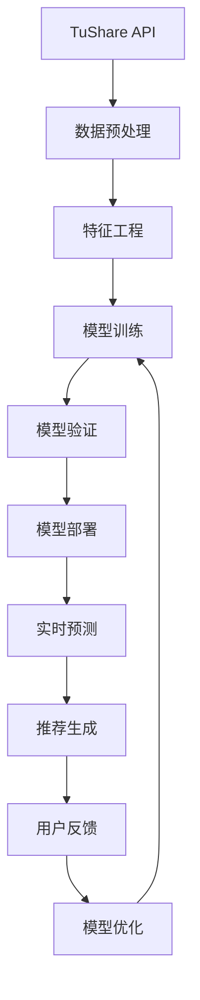

# 大模型股票预测推荐系统架构设计

## 系统概述

本系统基于现有TuShare数据平台，构建一个端到端的大模型训练、预测和推荐系统，旨在提高股票投资决策的准确性和智能化水平。

## 技术架构

### 1. 数据层 (Data Layer)
- **历史数据源**: TuShare Pro API，包含股票基本信息、日线数据、财务数据等
- **技术指标数据**: RSI、MACD、KDJ、布林带等50+技术指标
- **资金流向数据**: 大单、小单流入流出数据
- **市场情绪数据**: 龙虎榜、概念板块热度等
- **实时数据流**: WebSocket实时价格、成交量数据

### 2. 特征工程层 (Feature Engineering)
- **时序特征提取**: 价格趋势、波动率、成交量模式
- **技术指标组合**: 多时间窗口指标融合
- **基本面特征**: PE、PB、ROE等财务指标标准化
- **市场环境特征**: 板块轮动、市场情绪指标
- **序列编码**: 股票代码、行业分类的嵌入表示

### 3. 模型训练层 (Model Training)
#### 3.1 传统机器学习模型
- **随机森林**: 特征重要性分析和基础预测
- **XGBoost**: 梯度提升决策树，处理非线性关系
- **SVM**: 支持向量机，适合高维特征分类
- **逻辑回归**: 线性基准模型

#### 3.2 深度学习模型
- **LSTM网络**: 时序依赖建模，捕获长期趋势
- **Transformer**: 注意力机制处理多变量时序
- **CNN-LSTM**: 卷积提取局部模式+LSTM建模时序
- **GRU**: 轻量级循环网络，快速训练

#### 3.3 大语言模型集成
- **Ollama本地部署**: 使用llama3.1等开源模型
- **混合预测**: 结合数值预测和文本推理
- **多模态融合**: 技术分析+基本面分析+市场情绪

### 4. 预测推荐层 (Prediction & Recommendation)
- **多模型集成**: 投票机制和加权平均
- **置信度评分**: 模型预测可信度量化
- **风险评估**: 基于历史波动率的风险等级
- **动态调整**: 根据市场环境自适应权重

### 5. 反馈优化层 (Feedback & Optimization)
- **预测准确率追踪**: 实时监控模型表现
- **A/B测试框架**: 新模型版本对比验证
- **在线学习**: 增量更新模型参数
- **强化学习**: 基于投资组合表现的策略优化

## 数据流设计

## 模型训练策略

### 1. 数据分割策略
- **训练集**: 70% (最早的历史数据)
- **验证集**: 15% (中间时期数据)
- **测试集**: 15% (最近的数据)
- **时间窗口**: 3年历史数据，滚动更新

### 2. 特征选择策略
- **相关性分析**: 剔除高度相关特征
- **重要性排序**: 基于树模型的特征重要性
- **稳定性测试**: 不同时期特征表现一致性
- **业务逻辑验证**: 确保特征符合金融常识

### 3. 模型评估指标
- **回归任务**: RMSE、MAE、MAPE
- **分类任务**: Precision、Recall、F1-Score、AUC
- **金融指标**: 夏普比率、最大回撤、年化收益率
- **实时指标**: 预测延迟、吞吐量

### 4. 模型部署策略
- **模型版本管理**: Git+MLflow版本控制
- **A/B测试**: 新旧模型并行运行对比
- **灰度发布**: 逐步扩大新模型覆盖范围
- **回滚机制**: 快速回退到稳定版本

## 实现计划

### Phase 1: 基础架构 (Week 1-2)
1. 数据管道优化和标准化
2. 特征工程模块开发
3. 基础模型训练框架搭建
4. 模型评估体系建立

### Phase 2: 模型开发 (Week 3-4)
1. 传统ML模型实现和调优
2. 深度学习模型开发
3. 大语言模型集成
4. 多模型融合策略

### Phase 3: 部署优化 (Week 5-6)
1. 实时预测API开发
2. 推荐系统集成
3. 用户界面优化
4. 性能监控系统

### Phase 4: 反馈闭环 (Week 7-8)
1. 反馈收集机制
2. 在线学习系统
3. 自动化重训练
4. 系统稳定性优化

## 技术栈

### 机器学习框架
- **Scikit-learn**: 传统ML算法
- **XGBoost/LightGBM**: 梯度提升框架
- **PyTorch**: 深度学习模型
- **Transformers**: 预训练模型

### 数据处理
- **Pandas/NumPy**: 数据操作和数值计算
- **TA-Lib**: 技术指标计算
- **Scikit-learn**: 数据预处理和特征选择

### 模型管理
- **MLflow**: 实验跟踪和模型管理
- **Docker**: 模型容器化部署
- **Redis**: 模型缓存和实时数据

### 监控运维
- **Prometheus**: 系统监控
- **Grafana**: 可视化dashboard
- **ELK Stack**: 日志分析

## 预期效果

### 短期目标 (1-2个月)
- 基础预测准确率达到65%+
- 推荐股票胜率55%+
- 系统响应时间<500ms
- 支持1000+股票并发预测

### 中期目标 (3-6个月)
- 综合预测准确率70%+
- 推荐系统夏普比率>1.5
- 用户满意度85%+
- 日均处理百万级预测请求

### 长期目标 (6-12个月)
- 构建行业领先的AI投资助手
- 实现个性化投资策略定制
- 打造完整的量化投资生态
- 建立可持续的商业模式

## 风险控制

### 技术风险
- **数据质量**: 实时数据清洗和异常检测
- **模型过拟合**: 交叉验证和正则化
- **系统故障**: 高可用架构和故障转移
- **安全风险**: 数据加密和访问控制

### 业务风险
- **市场风险**: 多样化投资组合建议
- **合规风险**: 遵循金融监管要求
- **用户风险**: 明确风险提示和责任界定
- **竞争风险**: 持续技术创新和产品优化

## 成功指标

### 技术指标
- 模型准确率、召回率、F1-score
- 系统可用性、响应时间、吞吐量
- 数据质量分数、特征稳定性

### 业务指标  
- 用户活跃度、留存率、满意度
- 推荐命中率、投资收益率
- 市场份额、营收增长

这个架构设计为构建一个全面、可扩展的AI驱动股票预测推荐系统提供了详细的技术路线图和实施计划。