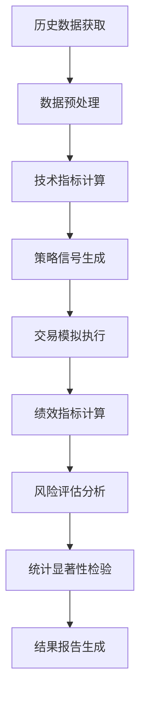

# 实际交易行情策略评估与验证完整指南

本指南详细介绍如何使用LJWX-Stock系统进行投资策略的评估与验证，确保策略在实际市场环境中的有效性。

## 🏗️ 系统架构

### 核心组件概览

```
┌─────────────────┐    ┌─────────────────┐    ┌─────────────────┐
│   数据获取层     │    │   策略引擎层     │    │   评估分析层     │
│                │    │                │    │                │
│ • TuShare API   │───▶│ • 信号生成器     │───▶│ • 回测引擎      │
│ • 历史行情数据   │    │ • 技术指标计算   │    │ • 绩效评估      │
│ • 实时价格流     │    │ • 策略逻辑执行   │    │ • 风险分析      │
└─────────────────┘    └─────────────────┘    └─────────────────┘
         │                       │                       │
         ▼                       ▼                       ▼
┌─────────────────┐    ┌─────────────────┐    ┌─────────────────┐
│   数据存储层     │    │ Walk-Forward    │    │   结果展示层     │
│                │    │   验证框架      │    │                │
│ • MySQL数据库   │    │ • 时序交叉验证   │    │ • Web仪表板     │
│ • 缓存系统      │    │ • 样本外测试     │    │ • API接口      │
│ • 数据清洗      │    │ • 稳健性分析     │    │ • 报告生成      │
└─────────────────┘    └─────────────────┘    └─────────────────┘
```

### 系统组件详解

#### 1. **数据获取与处理** (`data/`)
- **TuShareDataExtractor**: 历史行情数据获取
- **RealTimeDataStream**: 实时价格数据流
- **DataValidator**: 数据质量检验
- **FeatureEngineer**: 技术指标计算

#### 2. **策略验证引擎** (`strategy_validation/`)
- **StrategyValidator**: 策略验证主框架
- **BacktestEngine**: 历史回测引擎
- **WalkForwardAnalysis**: 时序前向分析
- **RiskAnalyzer**: 风险指标计算

#### 3. **评估框架** (`model_evaluation/`)
- **PerformanceMetrics**: 绩效指标体系
- **StatisticalAnalysis**: 统计显著性检验
- **BenchmarkComparison**: 基准比较分析
- **ReportGenerator**: 自动化报告生成

---

## 📈 验证方法论

### 回测验证流程



### 核心验证原则

#### **1. 时间序列完整性**
- ✅ 严格按时间顺序处理数据
- ✅ 避免前瞻偏差(Look-ahead Bias)
- ✅ 考虑交易滞后和执行延迟
- ✅ 处理停牌、除权除息事件

#### **2. 样本分割策略**
```python
# 训练集：历史数据的70%
train_start = "2020-01-01"
train_end = "2023-06-30"

# 验证集：用于参数调优，15%
validation_start = "2023-07-01"  
validation_end = "2023-12-31"

# 测试集：最终评估，15%
test_start = "2024-01-01"
test_end = "2024-12-31"
```

#### **3. Walk-Forward分析**
- **滑动窗口**: 模拟真实交易环境
- **参数稳定性**: 验证策略参数的时间稳定性
- **适应性测试**: 策略对市场变化的适应能力

---

## 🎯 评估指标体系

### 收益指标

| 指标名称 | 计算公式 | 解释说明 | 优秀标准 |
|---------|---------|---------|---------|
| **年化收益率** | `(总收益 + 1)^(252/交易日数) - 1` | 策略年化表现 | > 15% |
| **累计收益率** | `(期末价值 - 期初价值) / 期初价值` | 总体收益水平 | > 市场基准 |
| **超额收益率** | `策略收益 - 基准收益` | 相对基准表现 | > 3% |
| **信息比率** | `超额收益 / 跟踪误差` | 单位风险超额收益 | > 0.5 |

### 风险指标

| 指标名称 | 计算公式 | 解释说明 | 优秀标准 |
|---------|---------|---------|---------|
| **年化波动率** | `日收益率标准差 * √252` | 收益率不确定性 | < 25% |
| **最大回撤** | `max((峰值 - 谷值) / 峰值)` | 最大亏损幅度 | < 15% |
| **夏普比率** | `(年化收益 - 无风险收益) / 年化波动率` | 风险调整收益 | > 1.0 |
| **卡尔马比率** | `年化收益 / 最大回撤` | 回撤调整收益 | > 1.5 |
| **索提诺比率** | `年化收益 / 下行标准差` | 下行风险调整 | > 1.2 |
| **VaR (5%)** | `分位数风险价值` | 极端损失估计 | < 5% |

### 交易指标

| 指标名称 | 计算公式 | 解释说明 | 优秀标准 |
|---------|---------|---------|---------|
| **胜率** | `盈利交易次数 / 总交易次数` | 交易成功概率 | > 55% |
| **盈亏比** | `平均盈利 / 平均亏损` | 单次交易收益比 | > 1.5 |
| **交易频率** | `年交易次数` | 策略活跃程度 | 适中 |
| **平均持有期** | `总持有天数 / 交易次数` | 资金周转效率 | 与策略匹配 |

---

## 💹 数据获取与处理

### 真实行情数据源

#### **主要数据提供商**
```python
# TuShare Pro - 中国股市数据
import tushare as ts
ts.set_token('your_token')
pro = ts.pro_api()

# 日线数据获取
daily_data = pro.daily(
    ts_code='000001.SZ',
    start_date='20240101',
    end_date='20241231'
)

# 分钟级数据（VIP用户）
minute_data = pro.stk_mins(
    ts_code='000001.SZ',
    freq='1min',
    start_date='20241201 09:30:00',
    end_date='20241201 15:00:00'
)
```

#### **数据质量检验**
```python
class DataValidator:
    """数据质量验证器"""
    
    def validate_completeness(self, data: pd.DataFrame) -> bool:
        """检查数据完整性"""
        # 检查缺失值
        missing_ratio = data.isnull().sum() / len(data)
        if missing_ratio.max() > 0.05:  # 缺失超过5%
            return False
            
        # 检查价格合理性
        if (data['high'] < data['low']).any():
            return False
            
        if (data['close'] > data['high']).any():
            return False
            
        return True
    
    def detect_anomalies(self, data: pd.DataFrame) -> pd.DataFrame:
        """异常值检测"""
        # 价格跳跃检测
        returns = data['close'].pct_change()
        z_scores = np.abs((returns - returns.mean()) / returns.std())
        
        # 标记异常值（Z-score > 4）
        data['is_anomaly'] = z_scores > 4
        
        return data
```

### 技术指标计算

#### **主要技术指标库**
```python
class TechnicalIndicators:
    """技术指标计算器"""
    
    @staticmethod
    def rsi(prices: pd.Series, period: int = 14) -> pd.Series:
        """相对强弱指数"""
        delta = prices.diff()
        gain = delta.where(delta > 0, 0).rolling(window=period).mean()
        loss = (-delta.where(delta < 0, 0)).rolling(window=period).mean()
        rs = gain / loss
        return 100 - (100 / (1 + rs))
    
    @staticmethod
    def macd(prices: pd.Series, fast: int = 12, slow: int = 26, signal: int = 9) -> tuple:
        """MACD指标"""
        ema_fast = prices.ewm(span=fast).mean()
        ema_slow = prices.ewm(span=slow).mean()
        macd_line = ema_fast - ema_slow
        signal_line = macd_line.ewm(span=signal).mean()
        histogram = macd_line - signal_line
        return macd_line, signal_line, histogram
    
    @staticmethod
    def bollinger_bands(prices: pd.Series, window: int = 20, num_std: float = 2) -> tuple:
        """布林带"""
        sma = prices.rolling(window=window).mean()
        std = prices.rolling(window=window).std()
        upper_band = sma + (std * num_std)
        lower_band = sma - (std * num_std)
        return upper_band, sma, lower_band
```

---

## 🛠️ 策略验证实现

### 完整验证代码框架

```python
#!/usr/bin/env python3
"""
策略验证核心引擎
实现完整的策略回测、评估和分析功能
"""

import pandas as pd
import numpy as np
import tushare as ts
from datetime import datetime, timedelta
from typing import Dict, List, Optional, Tuple, Any
import logging
from dataclasses import dataclass
import json

@dataclass
class StrategyConfig:
    """策略配置"""
    name: str
    description: str
    parameters: Dict[str, Any]
    risk_params: Dict[str, float]
    benchmark: str = "000300.SH"  # 沪深300指数

@dataclass
class ValidationResult:
    """验证结果"""
    strategy_name: str
    test_period: str
    total_return: float
    annualized_return: float
    volatility: float
    sharpe_ratio: float
    max_drawdown: float
    calmar_ratio: float
    win_rate: float
    profit_loss_ratio: float
    total_trades: int
    benchmark_return: float
    excess_return: float
    information_ratio: float
    detailed_trades: List[Dict]
    monthly_returns: List[float]
    drawdown_series: List[float]

class AdvancedStrategyValidator:
    """高级策略验证器"""
    
    def __init__(self, config: StrategyConfig):
        self.config = config
        self.logger = self._setup_logger()
        self._init_data_source()
    
    def _setup_logger(self) -> logging.Logger:
        """设置日志系统"""
        logger = logging.getLogger(f"validator_{self.config.name}")
        handler = logging.StreamHandler()
        formatter = logging.Formatter(
            '%(asctime)s - %(name)s - %(levelname)s - %(message)s'
        )
        handler.setFormatter(formatter)
        logger.addHandler(handler)
        logger.setLevel(logging.INFO)
        return logger
    
    def _init_data_source(self):
        """初始化数据源"""
        try:
            ts.set_token(config.TS_TOKEN)
            self.pro = ts.pro_api()
            self.logger.info("数据源初始化成功")
        except Exception as e:
            self.logger.error(f"数据源初始化失败: {e}")
            raise
    
    def comprehensive_validation(self, 
                                stock_codes: List[str],
                                start_date: str,
                                end_date: str,
                                strategy_func: callable) -> ValidationResult:
        """
        综合策略验证
        
        Args:
            stock_codes: 测试股票代码列表
            start_date: 开始日期 (YYYY-MM-DD)
            end_date: 结束日期 (YYYY-MM-DD)
            strategy_func: 策略函数，返回交易信号
            
        Returns:
            ValidationResult: 详细验证结果
        """
        self.logger.info(f"开始验证策略: {self.config.name}")
        self.logger.info(f"测试期间: {start_date} 至 {end_date}")
        self.logger.info(f"测试股票: {len(stock_codes)} 只")
        
        # 1. 数据获取与预处理
        all_data = self._prepare_data(stock_codes, start_date, end_date)
        if not all_data:
            raise ValueError("无法获取有效的历史数据")
        
        # 2. 策略信号生成
        all_signals = {}
        for stock_code, data in all_data.items():
            signals = strategy_func(data, self.config.parameters)
            all_signals[stock_code] = signals
        
        # 3. 交易模拟执行
        portfolio_performance = self._simulate_trading(all_data, all_signals)
        
        # 4. 基准数据获取
        benchmark_performance = self._get_benchmark_performance(start_date, end_date)
        
        # 5. 绩效指标计算
        metrics = self._calculate_comprehensive_metrics(
            portfolio_performance, 
            benchmark_performance
        )
        
        # 6. 生成验证结果
        result = self._generate_validation_result(
            metrics, 
            portfolio_performance,
            start_date,
            end_date
        )
        
        self.logger.info(f"验证完成 - 年化收益: {result.annualized_return:.2%}, "
                        f"夏普比率: {result.sharpe_ratio:.2f}")
        
        return result
    
    def _prepare_data(self, stock_codes: List[str], start_date: str, end_date: str) -> Dict[str, pd.DataFrame]:
        """准备历史数据"""
        all_data = {}
        
        for stock_code in stock_codes:
            try:
                # 获取日线数据
                data = self.pro.daily(
                    ts_code=stock_code,
                    start_date=start_date.replace('-', ''),
                    end_date=end_date.replace('-', '')
                )
                
                if data.empty:
                    continue
                
                # 数据预处理
                data['trade_date'] = pd.to_datetime(data['trade_date'])
                data = data.sort_values('trade_date').reset_index(drop=True)
                
                # 添加技术指标
                data = self._add_technical_indicators(data)
                
                # 数据质量验证
                if self._validate_data_quality(data):
                    all_data[stock_code] = data
                
            except Exception as e:
                self.logger.warning(f"获取 {stock_code} 数据失败: {e}")
                continue
        
        return all_data
    
    def _add_technical_indicators(self, data: pd.DataFrame) -> pd.DataFrame:
        """添加技术指标"""
        # RSI
        data['rsi'] = self._calculate_rsi(data['close'])
        
        # MACD
        macd, signal, histogram = self._calculate_macd(data['close'])
        data['macd'] = macd
        data['macd_signal'] = signal
        data['macd_histogram'] = histogram
        
        # 布林带
        upper, middle, lower = self._calculate_bollinger_bands(data['close'])
        data['bb_upper'] = upper
        data['bb_middle'] = middle
        data['bb_lower'] = lower
        
        # 移动平均
        data['ma_5'] = data['close'].rolling(5).mean()
        data['ma_20'] = data['close'].rolling(20).mean()
        data['ma_60'] = data['close'].rolling(60).mean()
        
        # 成交量指标
        data['volume_ma'] = data['vol'].rolling(20).mean()
        data['volume_ratio'] = data['vol'] / data['volume_ma']
        
        return data
    
    def _simulate_trading(self, all_data: Dict[str, pd.DataFrame], all_signals: Dict[str, List]) -> Dict:
        """模拟交易执行"""
        portfolio = {
            'equity_curve': [],
            'trades': [],
            'positions': {},
            'cash': 100000,  # 初始资金10万
            'total_value': 100000
        }
        
        # 获取所有交易日
        all_dates = set()
        for data in all_data.values():
            all_dates.update(data['trade_date'])
        all_dates = sorted(list(all_dates))
        
        # 逐日模拟交易
        for date in all_dates:
            daily_value = self._process_daily_trading(
                portfolio, all_data, all_signals, date
            )
            portfolio['equity_curve'].append({
                'date': date,
                'total_value': daily_value,
                'cash': portfolio['cash'],
                'positions_value': daily_value - portfolio['cash']
            })
        
        return portfolio
    
    def _calculate_comprehensive_metrics(self, portfolio: Dict, benchmark: pd.DataFrame) -> Dict:
        """计算综合绩效指标"""
        equity_curve = pd.DataFrame(portfolio['equity_curve'])
        equity_curve['returns'] = equity_curve['total_value'].pct_change()
        
        # 基础收益指标
        total_return = (equity_curve['total_value'].iloc[-1] / equity_curve['total_value'].iloc[0]) - 1
        annualized_return = (1 + total_return) ** (252 / len(equity_curve)) - 1
        
        # 风险指标
        volatility = equity_curve['returns'].std() * np.sqrt(252)
        
        # 最大回撤
        cummax = equity_curve['total_value'].cummax()
        drawdown = (equity_curve['total_value'] - cummax) / cummax
        max_drawdown = abs(drawdown.min())
        
        # 夏普比率
        excess_returns = equity_curve['returns'] - 0.03/252  # 假设无风险收益率3%
        sharpe_ratio = excess_returns.mean() / excess_returns.std() * np.sqrt(252) if excess_returns.std() != 0 else 0
        
        # 卡尔马比率
        calmar_ratio = annualized_return / max_drawdown if max_drawdown != 0 else 0
        
        # 交易指标
        trades = portfolio['trades']
        profitable_trades = [t for t in trades if t['return'] > 0]
        win_rate = len(profitable_trades) / len(trades) if trades else 0
        
        avg_profit = np.mean([t['return'] for t in profitable_trades]) if profitable_trades else 0
        avg_loss = np.mean([t['return'] for t in trades if t['return'] < 0]) if any(t['return'] < 0 for t in trades) else 1
        profit_loss_ratio = abs(avg_profit / avg_loss) if avg_loss != 0 else 0
        
        # 基准比较
        if not benchmark.empty:
            benchmark_return = (benchmark['close'].iloc[-1] / benchmark['close'].iloc[0]) - 1
            excess_return = total_return - benchmark_return
            
            # 信息比率
            benchmark_returns = benchmark['close'].pct_change().dropna()
            if len(benchmark_returns) == len(equity_curve['returns'].dropna()):
                tracking_error = (equity_curve['returns'].dropna() - benchmark_returns).std() * np.sqrt(252)
                information_ratio = excess_return / tracking_error if tracking_error != 0 else 0
            else:
                information_ratio = 0
        else:
            benchmark_return = 0
            excess_return = total_return
            information_ratio = 0
        
        return {
            'total_return': total_return,
            'annualized_return': annualized_return,
            'volatility': volatility,
            'sharpe_ratio': sharpe_ratio,
            'max_drawdown': max_drawdown,
            'calmar_ratio': calmar_ratio,
            'win_rate': win_rate,
            'profit_loss_ratio': profit_loss_ratio,
            'total_trades': len(trades),
            'benchmark_return': benchmark_return,
            'excess_return': excess_return,
            'information_ratio': information_ratio,
            'equity_curve': equity_curve,
            'drawdown_series': drawdown.tolist()
        }

# 策略示例实现
def rsi_mean_reversion_strategy(data: pd.DataFrame, params: Dict) -> List[Dict]:
    """RSI均值回归策略"""
    signals = []
    position = None
    
    rsi_oversold = params.get('rsi_oversold', 30)
    rsi_overbought = params.get('rsi_overbought', 70)
    max_holding_days = params.get('max_holding_days', 30)
    
    for i in range(1, len(data)):
        current_rsi = data.iloc[i]['rsi']
        prev_rsi = data.iloc[i-1]['rsi']
        
        # 买入信号
        if position is None and prev_rsi < rsi_oversold and current_rsi > rsi_oversold:
            signals.append({
                'type': 'buy',
                'date': data.iloc[i]['trade_date'],
                'price': data.iloc[i]['close'],
                'index': i
            })
            position = 'long'
        
        # 卖出信号
        elif position == 'long' and (
            current_rsi > rsi_overbought or 
            (len(signals) > 0 and i - signals[-1]['index'] > max_holding_days)
        ):
            signals.append({
                'type': 'sell',
                'date': data.iloc[i]['trade_date'],
                'price': data.iloc[i]['close'],
                'index': i
            })
            position = None
    
    return signals

# 使用示例
def run_strategy_validation():
    """运行策略验证"""
    
    # 配置策略
    strategy_config = StrategyConfig(
        name="RSI均值回归策略",
        description="基于RSI指标的超买超卖交易策略",
        parameters={
            'rsi_oversold': 25,
            'rsi_overbought': 75,
            'max_holding_days': 25
        },
        risk_params={
            'max_position_size': 0.2,  # 单个股票最大仓位20%
            'stop_loss': 0.08,         # 止损8%
            'take_profit': 0.15        # 止盈15%
        }
    )
    
    # 初始化验证器
    validator = AdvancedStrategyValidator(strategy_config)
    
    # 测试股票池
    test_stocks = [
        '000001.SZ', '000002.SZ', '600036.SH', 
        '600519.SH', '000858.SZ', '002415.SZ'
    ]
    
    # 执行验证
    result = validator.comprehensive_validation(
        stock_codes=test_stocks,
        start_date='2023-01-01',
        end_date='2024-12-31',
        strategy_func=rsi_mean_reversion_strategy
    )
    
    # 输出结果
    print("="*60)
    print(f"策略验证报告: {result.strategy_name}")
    print("="*60)
    print(f"测试期间: {result.test_period}")
    print(f"总收益率: {result.total_return:.2%}")
    print(f"年化收益率: {result.annualized_return:.2%}")
    print(f"年化波动率: {result.volatility:.2%}")
    print(f"夏普比率: {result.sharpe_ratio:.2f}")
    print(f"最大回撤: {result.max_drawdown:.2%}")
    print(f"卡尔马比率: {result.calmar_ratio:.2f}")
    print(f"胜率: {result.win_rate:.2%}")
    print(f"盈亏比: {result.profit_loss_ratio:.2f}")
    print(f"总交易次数: {result.total_trades}")
    print(f"基准收益率: {result.benchmark_return:.2%}")
    print(f"超额收益率: {result.excess_return:.2%}")
    print(f"信息比率: {result.information_ratio:.2f}")
    
    return result

if __name__ == "__main__":
    result = run_strategy_validation()
```

---

## 🎨 高级分析技术

### Walk-Forward分析实现

```python
class WalkForwardValidator:
    """Walk-Forward验证器"""
    
    def __init__(self, window_size: int = 252, step_size: int = 21):
        self.window_size = window_size  # 训练窗口大小（交易日）
        self.step_size = step_size      # 步进大小
    
    def validate(self, data: pd.DataFrame, strategy_func: callable, params: Dict) -> Dict:
        """执行Walk-Forward分析"""
        results = []
        
        start_idx = self.window_size
        while start_idx + self.step_size < len(data):
            # 训练期数据
            train_data = data.iloc[start_idx-self.window_size:start_idx]
            
            # 测试期数据
            test_data = data.iloc[start_idx:start_idx+self.step_size]
            
            # 参数优化（可选）
            optimized_params = self._optimize_parameters(train_data, strategy_func, params)
            
            # 样本外测试
            test_result = self._test_strategy(test_data, strategy_func, optimized_params)
            
            results.append({
                'train_period': (train_data['trade_date'].iloc[0], train_data['trade_date'].iloc[-1]),
                'test_period': (test_data['trade_date'].iloc[0], test_data['trade_date'].iloc[-1]),
                'params': optimized_params,
                'performance': test_result
            })
            
            start_idx += self.step_size
        
        return self._analyze_walk_forward_results(results)
```

### 蒙特卡洛模拟

```python
class MonteCarloValidator:
    """蒙特卡洛验证器"""
    
    def simulate_strategy_robustness(self, 
                                   strategy_returns: List[float], 
                                   n_simulations: int = 10000) -> Dict:
        """模拟策略稳健性"""
        
        simulation_results = []
        
        for _ in range(n_simulations):
            # 随机重采样收益序列
            simulated_returns = np.random.choice(
                strategy_returns, 
                size=len(strategy_returns), 
                replace=True
            )
            
            # 计算模拟的累计收益
            cumulative_return = (1 + np.array(simulated_returns)).prod() - 1
            max_drawdown = self._calculate_max_drawdown(simulated_returns)
            sharpe_ratio = self._calculate_sharpe_ratio(simulated_returns)
            
            simulation_results.append({
                'cumulative_return': cumulative_return,
                'max_drawdown': max_drawdown,
                'sharpe_ratio': sharpe_ratio
            })
        
        return self._analyze_monte_carlo_results(simulation_results)
```

---

## 📊 结果展示与报告

### 自动化报告生成

```python
class StrategyReport:
    """策略报告生成器"""
    
    def generate_comprehensive_report(self, validation_result: ValidationResult) -> str:
        """生成综合报告"""
        
        report = f"""
# {validation_result.strategy_name} 验证报告

## 📋 基本信息
- **测试期间**: {validation_result.test_period}
- **报告生成时间**: {datetime.now().strftime('%Y-%m-%d %H:%M:%S')}

## 📈 收益表现
| 指标 | 数值 | 评级 |
|-----|------|------|
| 总收益率 | {validation_result.total_return:.2%} | {self._rate_performance(validation_result.total_return, 'return')} |
| 年化收益率 | {validation_result.annualized_return:.2%} | {self._rate_performance(validation_result.annualized_return, 'annual_return')} |
| 超额收益率 | {validation_result.excess_return:.2%} | {self._rate_performance(validation_result.excess_return, 'excess_return')} |

## 🎯 风险指标
| 指标 | 数值 | 评级 |
|-----|------|------|
| 年化波动率 | {validation_result.volatility:.2%} | {self._rate_performance(validation_result.volatility, 'volatility')} |
| 最大回撤 | {validation_result.max_drawdown:.2%} | {self._rate_performance(validation_result.max_drawdown, 'drawdown')} |
| 夏普比率 | {validation_result.sharpe_ratio:.2f} | {self._rate_performance(validation_result.sharpe_ratio, 'sharpe')} |

## 💼 交易统计
- **总交易次数**: {validation_result.total_trades}
- **胜率**: {validation_result.win_rate:.2%}
- **盈亏比**: {validation_result.profit_loss_ratio:.2f}

## 📝 策略评估结论
{self._generate_conclusion(validation_result)}

## 💡 优化建议
{self._generate_recommendations(validation_result)}
"""
        
        return report
    
    def _rate_performance(self, value: float, metric_type: str) -> str:
        """性能评级"""
        rating_criteria = {
            'annual_return': [(0.15, '优秀'), (0.10, '良好'), (0.05, '一般'), (0, '差')],
            'sharpe': [(1.5, '优秀'), (1.0, '良好'), (0.5, '一般'), (0, '差')],
            'drawdown': [(0.10, '差'), (0.15, '一般'), (0.25, '良好'), (1, '优秀')],
            'volatility': [(0.15, '优秀'), (0.20, '良好'), (0.30, '一般'), (1, '差')]
        }
        
        criteria = rating_criteria.get(metric_type, [(0, '一般')])
        
        for threshold, rating in criteria:
            if (metric_type in ['drawdown', 'volatility'] and value <= threshold) or \
               (metric_type not in ['drawdown', 'volatility'] and value >= threshold):
                return rating
        
        return '差'
```

---

## 🔧 实战应用示例

### 多策略组合验证

```python
def validate_strategy_portfolio():
    """多策略组合验证"""
    
    strategies = [
        {
            'name': 'RSI均值回归',
            'func': rsi_mean_reversion_strategy,
            'params': {'rsi_oversold': 25, 'rsi_overbought': 75},
            'weight': 0.4
        },
        {
            'name': 'MACD趋势跟踪', 
            'func': macd_trend_strategy,
            'params': {'fast': 12, 'slow': 26, 'signal': 9},
            'weight': 0.3
        },
        {
            'name': '布林带突破',
            'func': bollinger_breakout_strategy, 
            'params': {'window': 20, 'num_std': 2},
            'weight': 0.3
        }
    ]
    
    # 分别验证各策略
    individual_results = []
    for strategy in strategies:
        config = StrategyConfig(
            name=strategy['name'],
            description=f"{strategy['name']}策略验证",
            parameters=strategy['params'],
            risk_params={'max_position_size': 0.1}
        )
        
        validator = AdvancedStrategyValidator(config)
        result = validator.comprehensive_validation(
            stock_codes=['000001.SZ', '000002.SZ', '600036.SH'],
            start_date='2023-01-01',
            end_date='2024-12-31',
            strategy_func=strategy['func']
        )
        
        individual_results.append(result)
    
    # 组合策略验证
    portfolio_result = validate_combined_portfolio(strategies, individual_results)
    
    return individual_results, portfolio_result
```

### 实盘模拟交易

```python
class PaperTradingEngine:
    """纸面交易引擎"""
    
    def __init__(self, initial_capital: float = 100000):
        self.initial_capital = initial_capital
        self.current_capital = initial_capital
        self.positions = {}
        self.trade_history = []
        self.daily_pnl = []
    
    def execute_signal(self, signal: Dict, current_price: float):
        """执行交易信号"""
        stock_code = signal['stock_code']
        signal_type = signal['type']
        timestamp = signal['timestamp']
        
        if signal_type == 'buy':
            self._execute_buy(stock_code, current_price, timestamp)
        elif signal_type == 'sell':
            self._execute_sell(stock_code, current_price, timestamp)
    
    def _execute_buy(self, stock_code: str, price: float, timestamp: datetime):
        """执行买入"""
        if stock_code not in self.positions:
            # 计算买入数量（固定金额）
            trade_amount = min(10000, self.current_capital * 0.1)  # 最多10%仓位
            shares = int(trade_amount / price / 100) * 100  # 整百股
            
            if shares > 0:
                cost = shares * price
                self.current_capital -= cost
                
                self.positions[stock_code] = {
                    'shares': shares,
                    'avg_price': price,
                    'entry_time': timestamp
                }
                
                self.trade_history.append({
                    'stock_code': stock_code,
                    'type': 'buy',
                    'shares': shares,
                    'price': price,
                    'timestamp': timestamp,
                    'cost': cost
                })
    
    def _execute_sell(self, stock_code: str, price: float, timestamp: datetime):
        """执行卖出"""
        if stock_code in self.positions:
            position = self.positions[stock_code]
            shares = position['shares']
            proceeds = shares * price
            
            self.current_capital += proceeds
            
            # 计算收益
            cost_basis = shares * position['avg_price']
            pnl = proceeds - cost_basis
            pnl_pct = pnl / cost_basis
            
            self.trade_history.append({
                'stock_code': stock_code,
                'type': 'sell',
                'shares': shares,
                'price': price,
                'timestamp': timestamp,
                'proceeds': proceeds,
                'pnl': pnl,
                'pnl_pct': pnl_pct,
                'holding_days': (timestamp - position['entry_time']).days
            })
            
            # 清除持仓
            del self.positions[stock_code]
    
    def get_portfolio_status(self) -> Dict:
        """获取组合状态"""
        total_value = self.current_capital
        
        # 计算持仓市值（需要实时价格）
        positions_value = 0
        for stock_code, position in self.positions.items():
            current_price = self._get_current_price(stock_code)  # 获取当前价格
            positions_value += position['shares'] * current_price
        
        total_value += positions_value
        
        return {
            'total_value': total_value,
            'cash': self.current_capital,
            'positions_value': positions_value,
            'total_pnl': total_value - self.initial_capital,
            'total_return': (total_value - self.initial_capital) / self.initial_capital,
            'positions': self.positions,
            'trade_count': len([t for t in self.trade_history if t['type'] == 'sell'])
        }
```

---

## 🚀 最佳实践与注意事项

### ✅ 验证最佳实践

1. **数据质量控制**
   - 使用多个数据源交叉验证
   - 处理分红、拆股等公司行为
   - 及时更新异常数据

2. **回测偏差避免**
   - 严格遵循时间顺序
   - 考虑交易成本和滑点
   - 避免过度拟合

3. **风险管理集成**
   - 设置合理的止损止盈
   - 控制单个标的最大仓位
   - 分散化投资降低集中度风险

4. **动态参数调整**
   - 定期重新优化参数
   - 监控策略衰减情况
   - 适应市场环境变化

### ⚠️ 常见陷阱

1. **幸存者偏差**: 只测试仍在交易的股票
2. **前瞻偏差**: 使用未来信息进行决策
3. **数据挖掘偏差**: 过度优化历史数据
4. **交易成本忽略**: 未考虑实际交易费用
5. **流动性问题**: 忽略大资金对市场的冲击

---

## 📚 扩展阅读

### 推荐书籍
- 《量化交易：如何建立自己的算法交易事业》- Ernest P. Chan
- 《机器学习与资产定价》- Stefan Nagel  
- 《金融风险管理》- Joel Bessis

### 相关资源
- [QuantLib](https://www.quantlib.org/) - 量化金融库
- [Zipline](https://github.com/quantopian/zipline) - 算法交易回测引擎
- [PyAlgoTrade](https://github.com/gbeced/pyalgotrade) - Python算法交易库

---

*本指南将随着系统功能的完善持续更新，欢迎反馈和建议。*